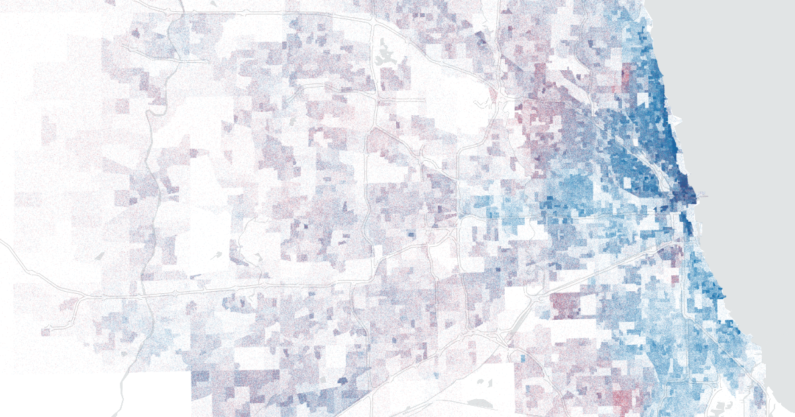

# Illinois 2020 General Election Precinct Maps

Maps of statewide precinct-level results for Illinois in the 2020 general election. [11ty](https://www.11ty.dev/) is used to build the site and [Mapbox GL JS](https://github.com/mapbox/mapbox-gl-js) is used to render results.

## Prerequisites

You'll need [Node](https://nodejs.org/en/) to run the site locally. To build the map tiles you'll need GNU Make, [xsv](https://github.com/burntsushi/xsv), [tippecanoe](https://github.com/mapbox/tippecanoe), and [aggspread](https://github.com/pjsier/aggspread) installed.

## Attribution

The code used to generate all precinct results and boundaries can be found in [pjsier/il-2020-election-precinct-data](https://github.com/pjsier/il-2020-election-precinct-data). All precinct boundaries are come from local election authorities or 2016 boundaries from the [Voting and Election Science Team, Harvard Dataverse](https://doi.org/10.7910/DVN/NH5S2I/IJPOUH) when they haven't changed. Results come from the [Illinois State Board of Elections](https://www.elections.il.gov/).

## Acknowledgments

Thanks to Paula Friedrich for being a sounding board
